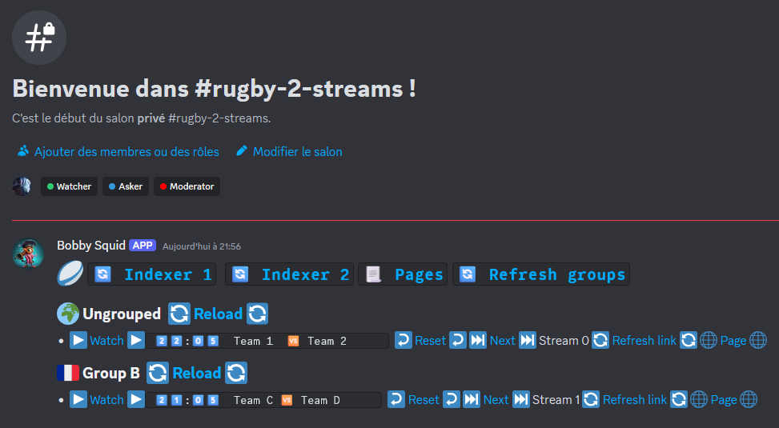
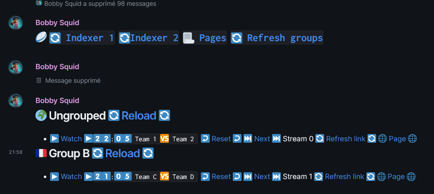
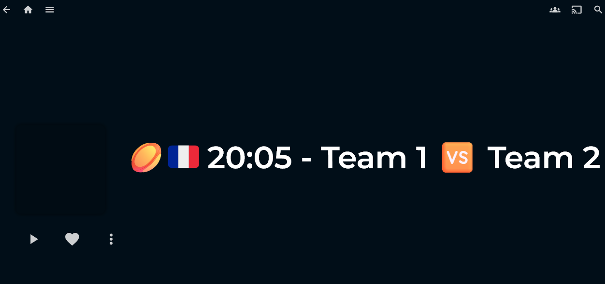
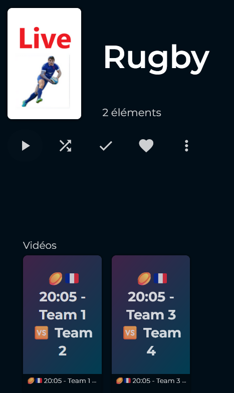

# Broadcastarr

Broadcastarr is a service that allows you to broadcast media content retrieved from web pages.

## Features

### AgendaTS

The different actions are split into tasks that are handled by the AgendaTS service.
The tasks are:

- Publish category
  Ensures that the active categories are published, and starts indexing the categories for each active indexer.
- Index category
  Indexes the category for each a given indexer, schedules the next indexation and the grabbing of the broadcast stream.
- Grab broadcast stream
  Grabs the broadcast stream for each broadcast in the category, schedules the release of the broadcast.
- Release broadcast
  Releases the broadcast to the active releasers, schedules the publishing of associated group.
- Publish group
  Publishes the group to the active publishers.
- Update category channel name
  Updates the category channel name on the active publishers.
- Delete broadcast
  Deletes the broadcast.

### Discord Bot

Handles interactions and commands via Discord.
If no authorization was set, the bot will be available to everyone.
Available commands:

- addcategory
- addrole
- indexcategory
- removecategory
- setcategoryemoji
- setconfig
- setgroupemoji
- togglegroup
- toggleindexer
- togglepublisher
- togglereleaser

### Releaser

A releaser is a service that can read the broadcasts.

Implemented releasers:

- Jellyfin

### Publisher

A publisher is a service that can publish the categories, groups and broadcasts to different platforms.

Implemented publishers:

- Discord
- Matrix
- Gotify

### Scalability

The service is designed to be scalable and can be deployed on multiple instances.

### VPN (Wireguard)

The docker has a cron that runs `./scripts/gateway.sh`.
This script checks if a container named `wireguard` can be pinged, if it can, the default gateway of the container (server, worker, init) is set to the ip of the `wireguard` container.

## Installation

Ensure the DB volume is created.

```sh
docker volume create broadcastarr_data
```

Then you need to create the env files and fill them with the correct values.

```sh
cp .env.default .env
cp .env.bootstrap.default .env.bootstrap
```

Then you need to bootstrap the database and shut it down.

```sh
docker compose -f ./docker-compose.bootstrap.yml up bootstrap
docker compose -f ./docker-compose.bootstrap.yml down
```

Finally you can start the service.

```sh
docker compose up -d
```

Additionally you can have multiple workers in the compose file to handle more tasks at the same time.

## Configuration

### Bootstrap

In the .env.bootstrap file:

- Set the different delay values (in second).
- Set the limit values (in minutes).
- Set the Categories to create with their respective emoji.

```.env
CATEGORIES_EMOJI=Football:⚽,Basketball:🏀
```

- Set the groups to create with their respective category and country.

```.env
GROUPS="Football:France*Ligue 1,Spain*La Liga|Basketball:USA*NBA"
```

- Set the discord webhookks to activate.

```.env
DISCORD_WEBHOOKS="Football:id:token,Rugby:id:token"
```

- Set the publishers to activate.

```.env
CREATE_PUBLISHER_DISCORD=true
CREATE_PUBLISHER_MATRIX=false
CREATE_PUBLISHER_GOTIFY=false
```

- Set the releasers to activate.

```.env
CREATE_RELEASER_JELLYFIN=true
```

Add the definitions of the indexers as json files in the folder ./data

```typescript
type Replacement = {
  regex: RegExp
  replace: string
}

type DateReplacement = {
  regex: RegExp
  format: string
}

type Selector = {
  path: string
}

type TextContentSelector = Selector & {
  attribute?: string
  replacement?: Replacement
}

type DateSelector = TextContentSelector & {
  format?: string
  dateReplacement?: DateReplacement
}

type RegexSelector<T extends Record<string, string>> = TextContentSelector & {
  regex: RegExp
  default?: T
}
```

```jsonc
{
  "name": string,
  "url": string,
  "active": boolean,
  // The data to configure the indexation
  "data": {
    "category": {
      // The links to retrieve the categories
      "links": Selector[],
      // When set, the lookup is a map category => strings to look for in the category name in the links textContent retrieved by the links selectors
      "lookups": Map<string, string[]>,
    },
    // Element to wait before looking for links
    "loadPageElement": string,
    // Broadcasts can be grouped by sets, in this case we start by looking for the day
    "broadcastSets": {
        // The selectors to retrieve the sets of broadcasts
        "selector": Selector[],
        // The selectors to retrieve the day
        "day": DateSelector[],
        // Some sites have  a "today" string instead of the current date, in this case we need to replace it
        "today": {
        "regex": string,
        "format": string,
        },
    },
    // The selectors to retrieve the broadcasts, is run in the context of the set, or the page if not set
    "broadcast": {
      // The selectors to retrieve the broadcasts
      "selector": Selector[],
      // The selectors to retrieve the broadcast start time, is run in the context of the broadcast
      "startTime": DateSelector[],
      // The selectors to retrieve the broadcast link, is run in the context of the broadcast
      "link": TextContentSelector[],
      // The selectors to retrieve the broadcast title, is run in the context of the broadcast
      "name": TextContentSelector[],
      // The selectors to retrieve the broadcast group, is run in the context of the broadcast
      "group": RegexSelector[],
    },
    // The selectors to retrieve the next page link, as long as there is a next page, and the broadcastSets start before the future limit, we go to the next page and continue the indexation
    "nextPage": Selector[],
  },
  // The data to configure the grabbing
  "interceptorData": {
    // Element to wait before looking for stream items
    "loadPageElement": string,
    // The selectors to retrieve the stream items
    "streamItems": Selector[],
    // The selectors to retrieve the score of the broadcast, is run in the context of the stream item
    "positiveScores": Selector[],
    // The selectors to retrieve the link of the broadcast, is run in the context of the stream item
    "link": TextContentSelector[],
    // If set, we go to the link(s) previously found with a referer header
    "referer": string,
    // If set, we click on the items found (play button for instance)
    "clickButton": Selector[],
  }
}
```

### Runtime

Some values are set in the docker compose such as :

- MONGO_URL
- MONGO_AGENDA_DB
- MONGO_DB
  Because the mongo container is probably running in the same stack, those env variables probably don't need to be changed.

The other values are set in the .env file:

```sh
# The user ID of the container owner
UID=
# 0: silly, 1: trace, 2: debug, 3: info, 4: warn, 5: error, 6: fatal
LOG_LEVEL=
# The port on which the server will listen
PORT=
# The folder where the M3U8 files are stored, must be accessible by the Jellyfin container too at the same path
M3U8_FOLDER=

# The timezone of the server
TZ=

# The user agent to use for the scrapper
USER_AGENT=
# The URL of which you'll access the API
BROADCASTARR_REMOTE_URL=

# The URL of the Jellyfin server
JELLYFIN_URL=
# The token to use to access the Jellyfin server
JELLYFIN_TOKEN=

# The token of the user to use to send messages
DISCORD_USER_TOKEN=
# The URL of the avatar to use for the webhook, can be empty
DISCORD_WEBHOOK_AVATAR=
# The username to use for the webhook, can be empty
DISCORD_WEBHOOK_USERNAME=

# Whether the Discord bot is active or not
DISCORD_BOT_ACTIVE=
# The token of the Discord bot
DISCORD_BOT_TOKEN=
# The client ID of the Discord bot
DISCORD_BOT_CLIENT_ID=

# The URL of the Matrix server
MATRIX_URL=
# The name of the Matrix server
MATRIX_SERVER_NAME=
# The user to use to send messages
MATRIX_USER=
# The access token of the user
MATRIX_ACCESS_TOKEN=
# Additional admins to add to the room
MATRIX_ADDITIONAL_ADMINS=

# The URL of the Gotify server
GOTIFY_URL=
# The token of the Gotify server
GOTIFY_TOKEN=
```

### Server & Workers

Fill the .env file with the correct values.

## Screenshots

### Discord publish



### Matrix publish



### Broadcast page on Jellyfin



### Collection page on Jellyfin


